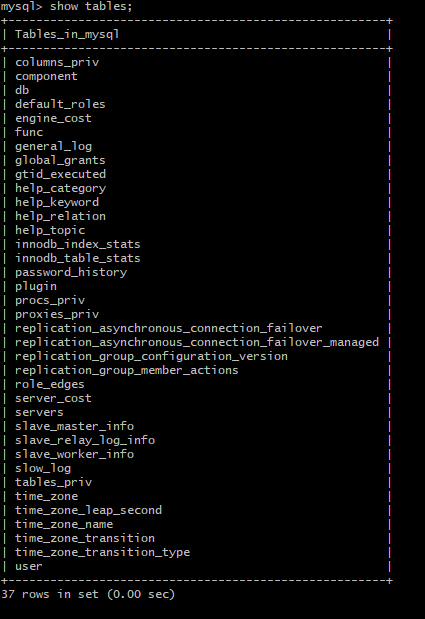
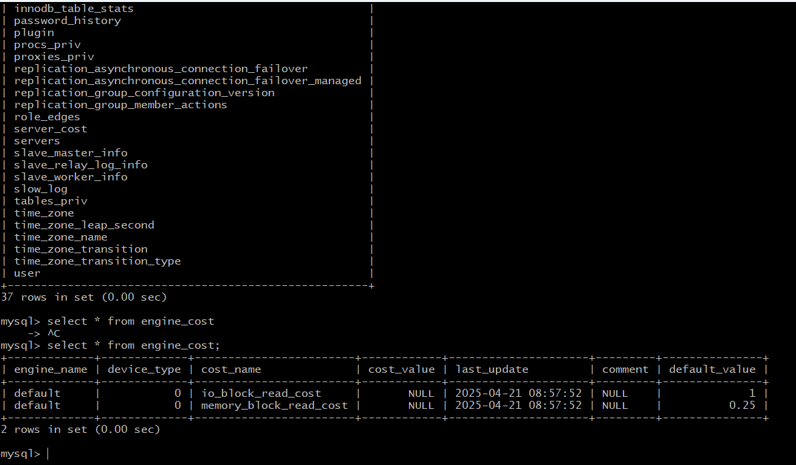

# MySQL Installation & Basic Commands on Ubuntu

This guide covers the installation and initial usage of MySQL Server on an Ubuntu system.

---

## Step 1: Update System Packages

```bash
sudo apt update
```
- Updates the list of available packages and their versions.

---

## Step 2: Install MySQL Server

```bash
sudo apt install mysql-server -y
```
- Installs the MySQL server and client packages.
- `-y` automatically confirms the installation prompt.

---

##  Step 3: Start the MySQL Service

```bash
sudo systemctl start mysql
```
- Starts the MySQL service (mysqld).

---

## Step 4: Check MySQL Service Status

```bash
sudo systemctl status mysql
```
- Displays the current status of the MySQL service.
- Look for `active (running)` to confirm it’s working.

---

##  Step 5: Enable MySQL to Start on Boot

```bash
sudo systemctl enable mysql
```
- Automatically starts the MySQL service on system reboot.

---

##  Step 6: Access MySQL as Root User

```bash
sudo mysql -u root -p
```
- Logs in to the MySQL shell as the root user.
- You will be prompted to enter the root password.

---

##  Step 7: Basic SQL Commands

###  Show all databases
```sql
SHOW DATABASES;
```

### Show all tables in the current database
```sql
SHOW TABLES;
```


###  View data from a specific table
```sql
SELECT * FROM engine_cost;
```

> `engine_cost` must exist in the selected database. If not, switch to the appropriate database using `USE db_name;`

---
