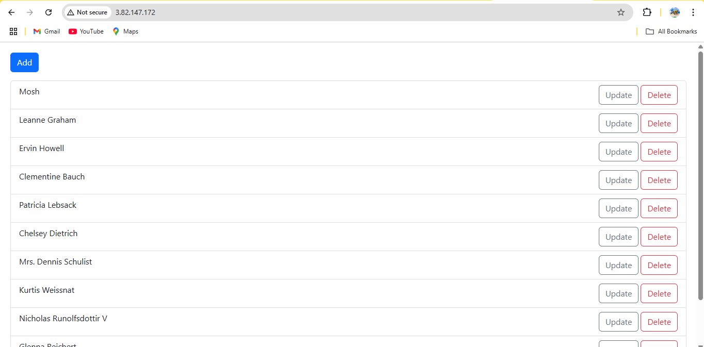

# 🚀 Deploying a React App using Apache Web Server

## 📁 Step-by-Step Commands and Explanation

### ✅ Step 1: Clone the React Project

```
git clone https://github.com/mosh-hamedani/react-course-part1.git
ls
cd react-course-part1/
ls
```
Clones the React course project by Mosh Hamedani from GitHub.

Enters the project directory.

### ✅ Step 2: Install Node.js Dependencies
```
nodejs
npm
npm install
```
Ensures node and npm are installed.

Installs all project dependencies listed in package.json.

### ✅ Step 3: Fix Vulnerabilities (Optional)
```
npm audit
npm audit fix
npm audit fix --force
```
Audits and auto-fixes known vulnerabilities in dependencies.

### ✅ Step 4: Build the React App
```
npm run build
```
Compiles the React app for production.

Output is placed inside the dist/ folder.

### ✅ Step 5: Verify Build Output
```
ls
cd dist/
ls
cat index.html
```
Checks that the build artifacts were successfully created.

Views the index.html file to verify build content.

### ✅ Step 6: Install Apache Web Server
```
cd
cd /var/
ls
cd
cd /opt/
ls
apache2
apt install apache2-bin
cd
apt install apache2
```
Navigates and checks directory structure.

Installs Apache2 (apache2-bin and full package).

### ✅ Step 7: Start and Enable Apache2
```
cd /var/www/html/
ls
systemctl start apache2
systemctl enable apache2
systemctl status apache2
```
Starts the Apache2 service.

Enables it to start on boot.

Verifies its status.

### ✅ Step 8: Deploy the React Build to Apache Web Root
```
cd
cp -r react-course-part1/dist/* /var/www/html/
```
Copies all built static files from the dist/ folder to Apache’s root directory.

The default Apache root directory is /var/www/html/.

🌐 Accessing the React App
Once Apache2 is running, access your deployed app using:

http://<your-server-ip>/

📌 Notes
Ensure ports (e.g., 80 for HTTP) are open in your firewall/security group.

You can customize the domain or setup reverse proxy using Apache configs for production.