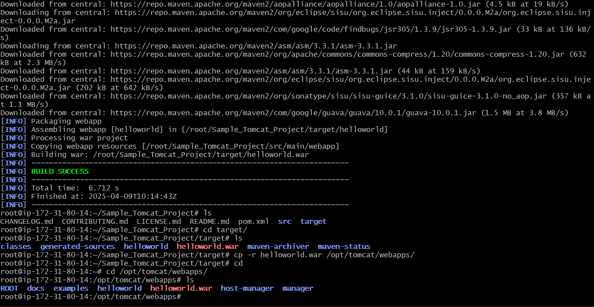
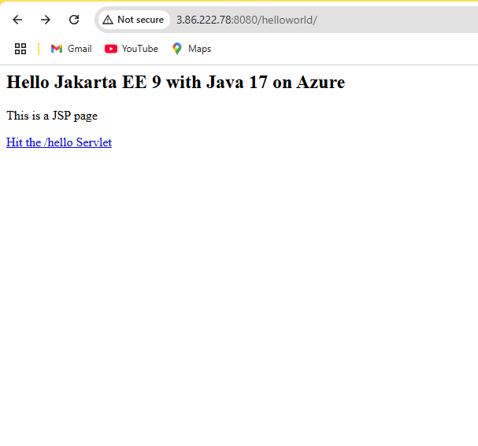

# 🚀 Deploying Java Web App to Apache Tomcat using Maven

## 📁 Step-by-Step Commands and Explanation

### ✅ Step 1: Clone the GitHub Repository

```bash
git clone https://github.com/Prashanth-MA/Sample_Tomcat_Project.git
```
Clones the Java web application project from GitHub to your local machine.


### ✅ Step 2: Navigate to the Project Directory

```
ls
cd Sample_Tomcat_Project/
ls
```
Lists current files and enters the cloned project directory.

### ✅ Step 3: Build the Project using Maven
```
mvn clean package
```

clean: Cleans the target directory.

package: Compiles code and creates a .war file.

### ✅ Step 4: Move the WAR file to Tomcat Webapps
```
ls
cd target/
ls
cp -r helloworld.war /opt/tomcat/webapps/
```
Navigates to the target directory where the .war file is generated.

Copies the helloworld.war file to the Tomcat webapps folder for deployment.

### ✅ Step 5: Start Apache Tomcat Server
```
cd
cd /opt/tomcat/webapps/
ls
cd /opt
ls
cd tomcat/
ls
cd bin
ls
./startup.sh
```
Navigates to the Tomcat bin directory.

Runs the startup.sh script to start the Tomcat server.

🌐 Accessing the Deployed Application
Once Tomcat is started, your application should be accessible at:

http://<your-server-ip>:8080/helloworld

📌 Notes
Ensure Java and Maven are installed.

Tomcat should be correctly installed in /opt/tomcat.

Port 8080 should be open in your firewall/security groups.
