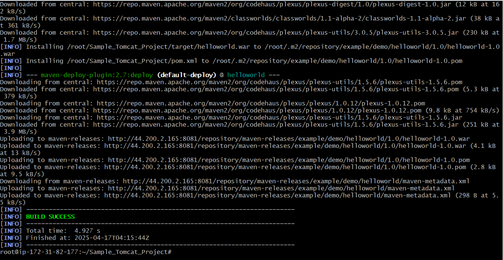
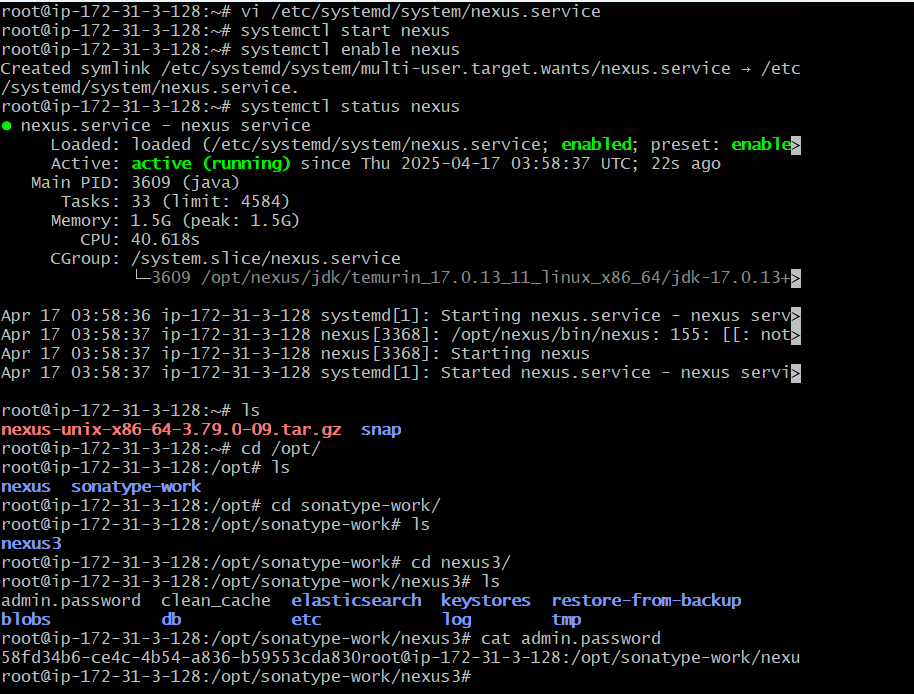
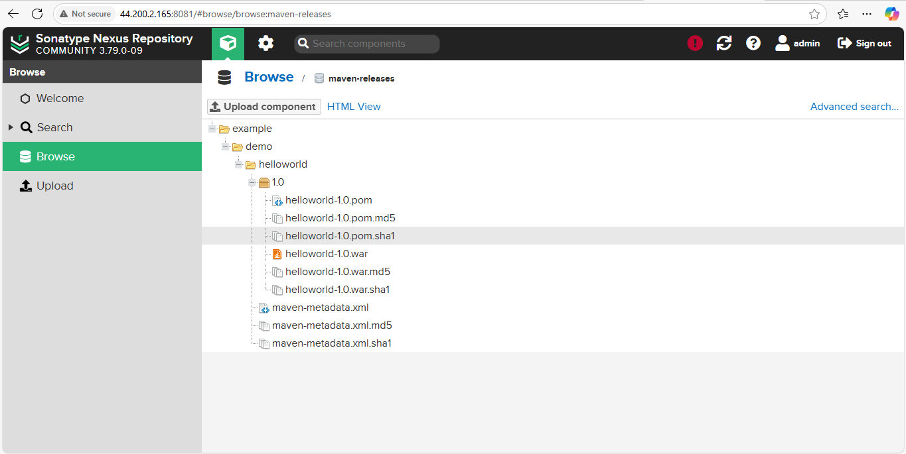

# Maven Project Deployment to Nexus Repository using Java 17

## Prerequisites

- Ubuntu-based system
- sudo/root access
- Git installed
- Nexus Repository Manager installed and running

---

## Step 1: Install Java 17

```bash
sudo apt update
sudo apt install openjdk-17-jdk -y
java -version
```

---

## Step 2: Install Maven

```bash
sudo apt install maven -y
```

---

## Step 3: Clone the Git Repository

Replace `<your-repo-url>` with the actual GitHub repository URL.

```bash
git clone <your-repo-url>
ls
cd Sample_Tomcat_Project/
ls
```

---

## Step 4: Configure `pom.xml`

Edit the `pom.xml` file and add the following `distributionManagement` block inside the `<project>` tag:

```xml
<distributionManagement>
  <repository>
    <id>maven-releases</id>
    <url>http://<your-nexus-ip>:8081/repository/maven-releases/</url>
  </repository>
</distributionManagement>
```

---

## Step 5: Add Nexus Credentials in Maven `settings.xml`

Edit the Maven settings file:

```bash
vim /etc/maven/settings.xml
```

Add the following under `<servers>` tag:

```xml
<server>
  <id>maven-releases</id>
  <username>admin</username>
  <password>Admin@123</password>
</server>
```

---

## Step 6: Build and Deploy the Maven Project

```bash
mvn clean
mvn package
mvn deploy
```

---

## Step 7: Download and Install Nexus Repository Manager

```bash
wget https://download.sonatype.com/nexus/3/nexus-unix-x86-64-3.79.0-09.tar.gz
tar -xvzf nexus-unix-x86-64-3.79.0-09.tar.gz
mv nexus-3.79.0-09/ /opt/nexus
mv sonatype-work/ /opt/
```

---

## Step 8: Create Nexus User and Set Permissions

```bash
adduser nexus
chown -R nexus:nexus /opt/nexus
chown -R nexus:nexus /opt/sonatype-work
```

---

## Step 9: Create Systemd Service for Nexus

```bash
sudo vi /etc/systemd/system/nexus.service
```

Add the following content:

```ini
[Unit]
Description=nexus service
After=network.target

[Service]
Type=forking
LimitNOFILE=65536
User=nexus
Group=nexus
ExecStart=/opt/nexus/bin/nexus start
ExecStop=/opt/nexus/bin/nexus stop
Restart=on-abort

[Install]
WantedBy=multi-user.target
```

---

## Step 10: Start and Enable Nexus

```bash
systemctl start nexus
systemctl enable nexus
systemctl status nexus
```

---

## Step 11: Access Nexus and Retrieve Admin Password

Navigate to the directory and display the admin password:

```bash
cd /opt/sonatype-work/nexus3/
ls
cat admin.password
```

Use the password to log in to Nexus at `http://<your-server-ip>:8081`.



---

## ✅ You're All Set!

You now have:
- Java 17 installed
- Maven installed
- A Maven project cloned and configured
- Nexus Repository installed and running
- Artifacts deployed to Nexus via `mvn deploy`
