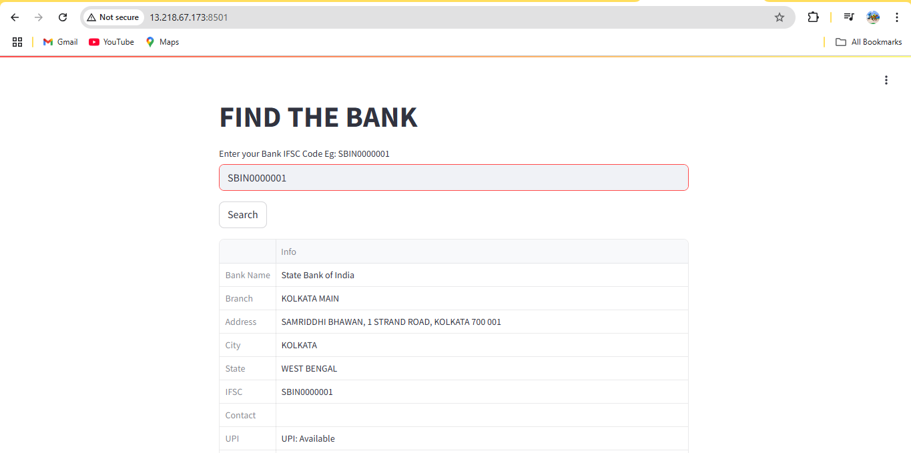

#  Deploying & Running FindTheBank (Python + Streamlit App)

## Step-by-Step Guide


### ✅ Step 1: Update System and Install Git

```
sudo apt update
git
```
Updates the system package list.

Ensures git is available (you can install it via sudo apt install git if not present).

### ✅ Step 2: Clone the Project from GitHub
```
git clone https://github.com/MainakRepositor/FindTheBank.git
ls
cd FindTheBank/
ls
```
Clones the FindTheBank repository and navigates into the project directory.

### ✅ Step 3: Install System-Level Dependencies
```
sudo apt install -y libmariadb-dev gcc g++ build-essential python3-dev dh-python
```
Installs essential libraries required for compiling Python packages.

### ✅ Step 4: Install Python & pip
```
sudo apt update && sudo apt install -y python3-pip
sudo apt install python3-venv -y
```
Installs pip and the venv module to manage virtual environments.

### ✅ Step 5: Create and Activate Virtual Environment
```
python3 -m venv venv
source venv/bin/activate
```
Creates a Python virtual environment named venv.

Activates the virtual environment.

### ✅ Step 6: Install Python Dependencies
```
pip install -r requirements.txt
```
Installs all Python libraries listed in requirements.txt.

🛠️ Optional: Manual Dependency Fixes
If facing issues with certain versions, you ran the following:
```
pip install setuptools==65.5.0
pip install numpy==1.24.4 --only-binary=:all:
pip install protobuf==3.20.*
pip uninstall urllib3 six -y
pip install urllib3==1.26.18 six
pip install --upgrade requests
pip install --upgrade click
pip install --upgrade --force-reinstall "click>=8.1.0"
pip install --upgrade pip setuptools wheel
pip install --upgrade streamlit
```
### ✅ Step 7: Run the Streamlit Application
```
streamlit run main.py
```
Launches the main Streamlit application.

Other variations you attempted:
```
streamlit run app.py
streamlit run api.py
```
### ✅ Step 8: Troubleshooting/Verification
Checked and edited requirements.txt using nano or vi multiple times.

Verified installed packages with pip show.

If Python 3.12 support was missing, manually downloaded and configured:

```
cd /usr/src
sudo wget https://www.python.org/ftp/python/3.12.2/Python-3.12.2.tgz
sudo tar -xzf Python-3.12.2.tgz
cd Python-3.12.2/Lib/distutils
sudo cp -r . /usr/lib/python3.12/distutils
```
🌐 Accessing the App
Once the Streamlit app is running, it will be accessible at:


http://<your-server-ip>:8501


📌 Notes
Use source venv/bin/activate before running the app every time you log in.

Ensure port 8501 is allowed in your firewall/security group settings.

